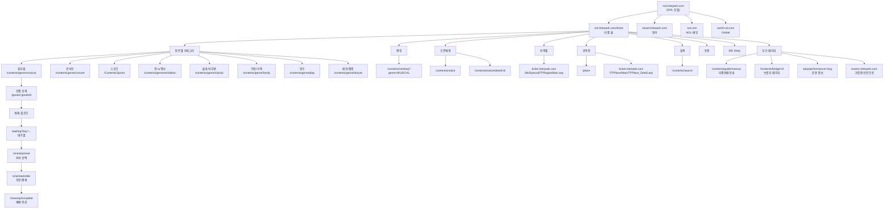
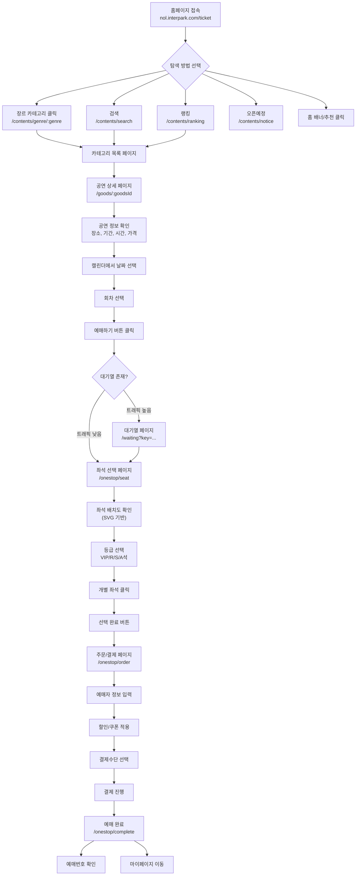

# NOL 티켓 (인터파크) 사이트 분석 리포트

## 분석 개요

| 항목 | 내용 |
|------|------|
| 대상 사이트 | NOL 티켓 (nol.interpark.com/ticket, tickets.interpark.com) |
| 분석 일시 | 2026-03-25 |
| 운영사 | (주)놀유니버스 |
| 프레임워크 | Next.js (SSR/CSR 하이브리드) |
| 슬로건 | "설렘을 예매하다" |
| 키워드 | NOL 티켓, 놀티켓, 뮤지컬, 연극, 콘서트, 전시, 공연, 축제, 페스티벌, 티켓팅 |

---

## 1. 사이트맵 (트리 구조)



---

## 2. URL 패턴 및 라우팅 규칙

### 2.1 도메인 구조

| 도메인 | 용도 | 기술 |
|--------|------|------|
| `nol.interpark.com` | NOL 포털 홈, 티켓 홈 | Next.js |
| `tickets.interpark.com` | 티켓 서비스 메인 (카테고리, 상세, 검색, 예매) | Next.js |
| `ticket.interpark.com` | 레거시 서비스 (스포츠, 지역별, 공연장 상세, 토핑) | ASP (레거시) |
| `events.interpark.com` | 기획전/프로모션 페이지 | 별도 시스템 |
| `accounts.interpark.com` | 인증/토큰 관리 | OAuth 시스템 |
| `nolmdshop.com` | MD 상품 쇼핑몰 | 별도 도메인 |

### 2.2 URL 패턴

| 패턴 | 예시 | 설명 |
|------|------|------|
| `/contents/genre/:genre` | `/contents/genre/musical` | 장르별 카테고리 |
| `/contents/ranking?genre=:GENRE` | `?genre=MUSICAL` | 랭킹 (쿼리 파라미터) |
| `/contents/notice` | - | 오픈예정 목록 |
| `/contents/notice/detail/:id` | `/detail/13220` | 오픈예정 상세 |
| `/contents/search` | - | 통합 검색 |
| `/contents/bridge/:id` | `/bridge/25017949` | 브릿지/랜딩 페이지 |
| `/contents/guide/manual` | - | 판매 안내 |
| `/goods/:goodsId` | `/goods/25012652` | 상품(공연) 상세 |
| `/place` | - | 공연장 목록 |
| `/waiting?key=:token` | - | 예매 대기열 |
| `/onestop/seat` | - | 좌석 선택 |
| `/onestop/order` | - | 주문/결제 |
| `/onestop/complete` | - | 예매 완료 |
| `/play/performance/:slug` | - | 공연 상세 정보 |

---

## 3. 글로벌 네비게이션 구조

### 3.1 GNB (Global Navigation Bar)

```
┌─────────────────────────────────────────────────────────────────┐
│ [NOL 로고] │ 인터파크 │ 투어 │ 티켓 │  [검색] [유저메뉴]       │
├─────────────────────────────────────────────────────────────────┤
│ 뮤지컬 │ 콘서트 │ 스포츠 │ 전시/행사 │ 클래식/무용 │           │
│ 아동/가족 │ 연극 │ 레저/캠핑 │ 토핑 │ MD shop                 │
├─────────────────────────────────────────────────────────────────┤
│ 랭킹 │ 오픈예정 │ 지역별 │ 공연장                              │
└─────────────────────────────────────────────────────────────────┘
```

**상단 헤더:**
- NOL 브랜드 로고 (nol.interpark.com 링크)
- 서비스 전환 탭: 인터파크 | 투어 | 티켓
- 검색 버튼 (submit type)
- 사용자 메뉴: 닉네임 버튼, 내 예약
- 상단 배너: NOL 프로모션 배너, 이벤트 배너

**1차 네비게이션 (장르별):**
- 뮤지컬, 콘서트, 스포츠, 전시/행사, 클래식/무용, 아동/가족, 연극, 레저/캠핑
- 토핑 (레거시 도메인), MD Shop (외부 도메인)

**2차 네비게이션 (기능별):**
- 랭킹, 오픈예정, 지역별, 공연장

### 3.2 Footer

- 이용약관, 위치기반서비스 이용약관, 개인정보처리방침
- 여행약관, 여행자보험 가입내역
- 티켓판매안내, 공지사항
- 고객센터, Language 선택
- 사업자 정보: (주)놀유니버스
- 관련 브랜드 링크: NOL, Triple, Interpark Global

---

## 4. 사용자 플로우 (예매 Critical Path)



### 4.1 단계별 상세

#### Step 1: 홈페이지 (엔트리 포인트)
- 타임딜 섹션: 카운트다운 타이머, 할인율, 가격 표시
- 파이널콜 섹션: 임박 공연 특가
- 얼리버드/프리뷰 할인 섹션
- 장르별 탭 필터 (뮤지컬 선택됨 기본)
- Swiper 기반 캐러셀/슬라이더

#### Step 2: 카테고리 목록
- 장르별 탭 네비게이션
- 서브카테고리 필터 버튼: 전체보기, 요즘 HOT, 오리지널/내한, 라이선스, 창작뮤지컬, 넌버벌퍼포먼스
- 공연 카드 리스트 (포스터 이미지 + 제목 + 장소 + 기간)
- 이전/다음 페이지네이션

#### Step 3: 공연 상세 페이지
**정보 영역:**
- 포스터 이미지
- 공연명, 배지 (단독판매, 좌석우위, 예매대기 등)
- 정보 항목: 장소, 공연기간, 공연시간, 관람연령, 가격(등급별), 혜택(무이자할부), 프로모션
- 소셜 공유: 페이스북, 트위터
- 티켓캐스트 등록 (알림 신청)

**예매 영역:**
- 캘린더 (월간 달력, 날짜 선택)
- 회차 선택 (시간 버튼)
- 예매하기 / 예매대기 버튼

**탭 콘텐츠:**
- 공연정보, 캐스팅정보, 판매정보, 관람후기, 기대평
- 캐스팅 일정조회

**관련 콘텐츠:**
- 관련 공연 링크
- NOL 카드 적립 프로모션
- "이 공연이 더 궁금하다면" → 공연 상세 정보 페이지

#### Step 4: 대기열 시스템
- URL: `/waiting?key=<encrypted_token>`
- 트래픽이 높을 때 자동 활성화
- 대기 순번 표시 (추정)
- 대기 완료 시 자동으로 좌석 선택 페이지로 이동

#### Step 5: 좌석 선택
- URL: `/onestop/seat`
- 헤더: 공연명, 선택 일시, 일정변경 버튼
- SVG 기반 좌석 배치도 (확대/축소/전체보기)
- 등급별 가격 표시 패널 (VIP석, R석, S석, A석)
- 선택 좌석 사이드 패널 (접기/열기 가능)
- "선택 완료" 버튼
- 취소/환불 안내 팝업 (취소마감시간 표시)
- 토큰 재발급 iframe (accounts.interpark.com/reissuetoken)

#### Step 6: 결제 (추정)
- URL: `/onestop/order` (추정)
- 예매자 정보 입력
- 결제수단 선택 (카드, 간편결제, 계좌이체)
- 쿠폰/포인트 적용
- 카카오머니 즉시할인 등 프로모션 적용

#### Step 7: 예매 완료
- URL: `/onestop/complete` (추정)
- 예매번호 표시
- 예매확인/취소 링크
- 마이페이지 연동

### 4.2 특수 예매 유형
- **일반 예매**: 날짜/회차 선택 → 좌석 선택 → 결제
- **로터리 티켓 (추첨제)**: 응모 → 당첨 확인 → 결제
- **예매대기**: 매진 시 취소 대기 등록
- **티켓캐스트**: 오픈 알림 사전 등록

---

## 5. 페이지별 상세 분석

### 5.1 홈페이지 (nol.interpark.com/ticket)

| 섹션 | 구성 요소 | 비고 |
|------|-----------|------|
| 상단 배너 | 프로모션 배너 (Swiper) | 자동 슬라이드 |
| 타임딜 | 카운트다운 타이머, 할인가, 원가 | 카드형 캐러셀 |
| 파이널콜 | 임박공연, D-day 표시 | 특가 할인율 표시 |
| 장르별 추천 | 탭 필터 (8개 장르) | 기본: 뮤지컬 |
| 할인 기획전 | 얼리버드, 프리뷰, 마티네, 재관람 | 카드형 |

### 5.2 카테고리 페이지 (/contents/genre/:genre)

| 요소 | 설명 |
|------|------|
| 장르 탭 | 8개 장르 + 토핑 + MD Shop |
| 서브필터 | 전체보기, 요즘 HOT, 오리지널/내한, 라이선스, 창작, 넌버벌 |
| 기획전 배너 | 상단 슬라이드 배너 |
| 상품 리스트 | 포스터+정보 카드, 캐러셀 |
| 페이지네이션 | 이전/다음 버튼 |

### 5.3 랭킹 페이지 (/contents/ranking)

| 요소 | 설명 |
|------|------|
| 장르 필터 | 뮤지컬, 콘서트, 스포츠 등 8개 탭 |
| 기간 필터 | 일간, 주간, 월간 |
| 랭킹 리스트 | 순위, 배지, 포스터, 공연명, 장소, 기간, 예매율 |
| 통계 버튼 | 각 공연별 통계 조회 |
| 배지 유형 | 단독판매, 좌석우위, NEW, 순위 변동 (상승/하락/유지) |

### 5.4 오픈예정 페이지 (/contents/notice)

| 요소 | 설명 |
|------|------|
| 정렬 필터 | 오픈순 정렬 |
| 장르 필터 | 장르별 필터링 |
| 지역 필터 | 지역별 필터링 |
| 리스트 | 오픈 시간, 공연명, 장소, 예매 유형 |
| 예매 유형 | 일반예매, 좌석우위 등 |

### 5.5 공연장 페이지 (/place)

| 요소 | 설명 |
|------|------|
| 제휴 공연장 슬라이더 | 주요 공연장 캐러셀 (Prev/Next) |
| 입점 공연장 목록 | 지역별 공연장 목록, 캐러셀 |
| 공연장 상세 링크 | 레거시 도메인 (ticket.interpark.com/TPPlace/) |
| 진행 중 공연 | 자세히보기 링크 |

### 5.6 검색 페이지 (/contents/search)

| 요소 | 설명 |
|------|------|
| 검색 입력 | GNB 통합 검색 |
| 장르 필터 | 뮤지컬, 콘서트, 연극, 클래식/무용, 스포츠, 레저/캠핑, 전시/행사, 아동/가족 |
| 판매종료 토글 | 판매종료 공연 보기 버튼 |
| 검색 결과 | 공연 카드 리스트 |
| 페이지네이션 | 다음 버튼 |

---

## 6. 수집된 디자인 토큰

### 6.1 컬러 팔레트

| 용도 | 값 |
|------|-----|
| Primary Text | `rgb(41, 41, 45)` / #29292D |
| Secondary Text | `rgba(41, 41, 45, 0.8)` |
| Tertiary Text | `rgba(41, 41, 45, 0.5)` |
| Accent/Brand | `rgb(53, 73, 255)` / #3549FF |
| Background | `rgb(255, 255, 255)` / #FFFFFF |
| Surface | `rgb(251, 251, 251)` / #FBFBFB |
| Surface Alt | `rgb(241, 241, 241)` / #F1F1F1 |
| Warning/Highlight | `rgb(255, 180, 27)` / #FFB41B |
| Gold/Premium | `rgb(255, 215, 0)` / #FFD700 |
| Dark | `rgb(0, 0, 0)` / #000000 |
| Border | `rgba(41, 41, 45, 0.15)` |
| Header BG | `rgb(4, 35, 50)` / #042332 (다크 헤더 변형) |

### 6.2 타이포그래피

| 요소 | 속성 |
|------|------|
| Font Family (홈) | `-apple-system, system-ui, Segoe UI, Roboto, Arial, Noto Sans, sans-serif` |
| Font Family (예매) | `-apple-system, system-ui, Apple SD Gothic Neo, 맑은 고딕, Malgun Gothic, sans-serif` |
| H1 | 20px, 700 weight, color: #29292D |
| H3 | 11.7px, 700 weight |
| Body | 10px base (rem 기반 스케일링 추정) |
| Heading (예매 페이지) | 17px, 700 weight |

### 6.3 컴포넌트 패턴

| 컴포넌트 | 상태/변형 |
|----------|-----------|
| 버튼 | Primary (예매하기), Secondary (일정변경), Ghost (등급별가격), Disabled (#DDD) |
| 배지 | 단독판매, 좌석우위, 예매대기, NEW, 순위변동(↑↓), 타임딜, 파이널콜 |
| 카드 | 공연 카드 (포스터+정보), 타임딜 카드 (타이머 포함), 랭킹 카드 (순위 포함) |
| 캘린더 | 월간 달력, 날짜 선택, 비활성 날짜 |
| 좌석 배치도 | SVG 기반, 확대/축소/전체보기 컨트롤 |
| 모달/팝업 | 취소/환불 안내, 가격 상세, 무이자할부 안내 |
| 탭 | 장르 탭, 상세페이지 탭 (공연정보/캐스팅/판매/후기/기대평) |
| 슬라이더 | Swiper 기반 캐러셀, 이전/다음 네비게이션 |
| 체크박스 | 티켓캐스트 등록, 하루동안 보지 않기 |
| 카운트다운 | D-day 표시, HH:MM:SS 타이머 |

---

## 7. 기술 스택 분석

| 항목 | 기술 |
|------|------|
| 프레임워크 | Next.js (React) - `#__next` 루트, `__NEXT_DATA__` 확인 |
| 슬라이더 | Swiper.js (`--swiper-theme-color: #007aff`) |
| 좌석 배치도 | SVG 기반 인터랙티브 좌석맵 |
| 인증 | 별도 계정 시스템 (accounts.interpark.com), 토큰 재발급 iframe |
| 대기열 | 자체 대기열 시스템 (`/waiting?key=<encrypted>`) |
| CSS | CSS Modules 추정 (`_mobile-header-placeholder_1k0gh_55` 패턴) |
| 레거시 공존 | ASP 기반 레거시 페이지 (ticket.interpark.com) 병행 운영 |
