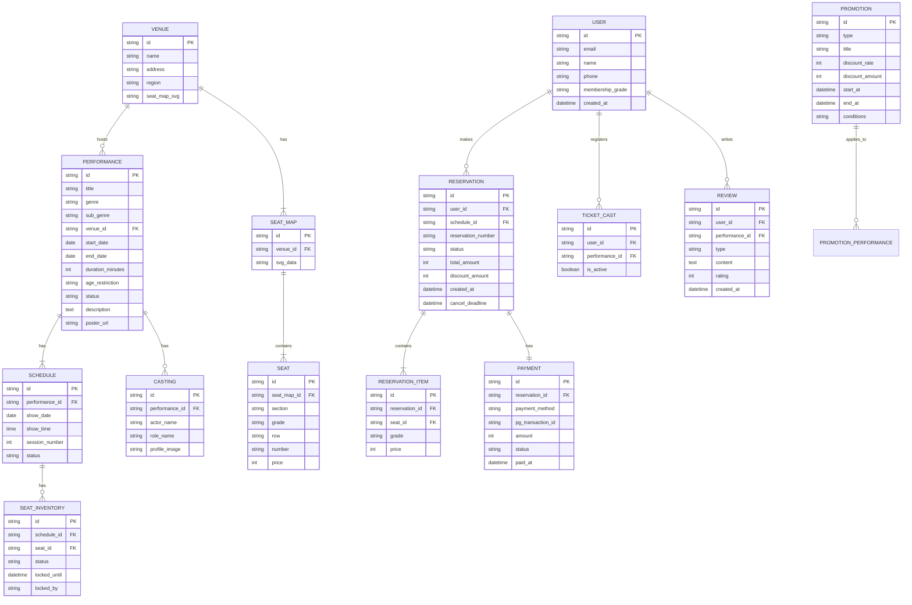

# Product Requirements Document: 티켓예매 플랫폼

## 1. 제품 개요

### 1.1 비전 & 미션

**비전:** 공연·전시·스포츠 등 모든 라이브 엔터테인먼트를 하나의 플랫폼에서 발견하고 예매할 수 있는 국내 최고의 티켓 플랫폼

**미션:** "설렘을 예매하다" — 사용자가 원하는 공연을 쉽고 빠르게 발견하고, 안정적으로 예매할 수 있는 경험을 제공

### 1.2 타겟 사용자 (Persona)

#### Persona 1: 공연 매니아 "지현" (28세, 직장인)
- 뮤지컬, 연극을 월 2-3회 관람
- 티켓 오픈 시간에 맞춰 즉시 예매하는 "티켓팅" 경험이 풍부
- 특정 배우의 캐스팅 일정을 체크하고 날짜를 선택
- 좌석 위치에 민감하며, 좌석 배치도를 통해 직접 선택하길 원함
- 재관람 할인, 멤버십 등급 혜택에 관심이 높음

#### Persona 2: 캐주얼 관람객 "민수" (35세, 가족 단위)
- 주말 가족 나들이로 전시/아동 공연을 분기 1-2회 방문
- 가격 할인, 타임딜에 관심이 높음
- 복잡한 좌석 선택보다 등급만 선택하면 자동 배정되길 원함
- 예매 후 캘린더에 자동 등록, 위치 안내 등 부가 서비스 기대
- 모바일에서 주로 접근

#### Persona 3: 콘서트 팬 "수진" (22세, 대학생)
- K-POP 콘서트, 페스티벌 위주 관람
- 티켓 오픈일에 치열한 경쟁을 경험 (대기열 시스템 진입)
- SNS에서 공연 정보를 공유하고, 티켓캐스트(오픈 알림)를 적극 활용
- 간편결제(카카오페이 등) 선호
- 매크로/봇에 대한 불만이 높음

### 1.3 핵심 가치 제안

1. **발견(Discovery):** 장르별 큐레이션, 랭킹, 타임딜로 공연을 쉽게 발견
2. **신뢰성(Reliability):** 대기열 시스템, 좌석 점유 관리로 안정적 예매 보장
3. **편의성(Convenience):** 원스톱(onestop) 예매 플로우로 최소 단계 결제
4. **공정성(Fairness):** 봇 방지, 대기열을 통한 공정한 예매 기회 제공

---

## 2. 기능 요구사항

### 2.1 사용자 기능 (참조 사이트 기반)

#### P0 (Must-Have)

**F-001: 회원 인증 시스템**
- 설명: 회원가입, 로그인, 소셜 로그인, 토큰 관리
- 수용 조건:
  - 이메일/소셜 로그인 지원
  - 세션 유지 및 토큰 자동 재발급 (iframe 기반 silent refresh)
  - 본인인증 연동 (예매 시 필요)
- 참조: accounts.interpark.com 인증 시스템

**F-002: 공연 상품 카탈로그**
- 설명: 공연/전시/스포츠 등 상품 목록 조회 및 상세 정보 표시
- 수용 조건:
  - 장르별 카테고리 페이지 (뮤지컬, 콘서트, 스포츠, 전시/행사, 클래식/무용, 아동/가족, 연극, 레저/캠핑)
  - 서브카테고리 필터 (전체, 요즘 HOT, 오리지널/내한, 라이선스, 창작 등)
  - 상세 정보: 장소, 기간, 공연시간, 관람연령, 등급별 가격, 혜택, 프로모션
  - 캐스팅 정보, 공연 정보, 판매 정보 탭
- 참조: /contents/genre/:genre, /goods/:goodsId

**F-003: 통합 검색**
- 설명: 공연명, 아티스트, 공연장 등 키워드 검색
- 수용 조건:
  - 실시간 자동완성 (추정)
  - 장르별 필터링
  - 판매종료 공연 포함/제외 토글
  - 검색 결과 카드형 리스트
- 참조: /contents/search

**F-004: 랭킹 시스템**
- 설명: 장르별 예매율 기반 실시간 랭킹
- 수용 조건:
  - 장르별 탭 필터 (8개 장르)
  - 기간 필터 (일간, 주간, 월간)
  - 순위, 예매율, 순위 변동 표시
  - 각 공연별 통계 조회 버튼
  - 배지 표시 (단독판매, 좌석우위, NEW)
- 참조: /contents/ranking?genre=MUSICAL

**F-005: 예매 플로우 (원스톱)**
- 설명: 날짜/회차 선택 → 대기열 → 좌석 선택 → 결제 → 완료
- 수용 조건:
  - 캘린더 기반 날짜 선택 (월간 달력)
  - 회차(시간) 선택 버튼
  - 대기열 시스템 (트래픽 스파이크 시 자동 활성화)
  - SVG 기반 좌석 배치도 (확대/축소/전체보기)
  - 등급별 좌석 구분 및 가격 표시
  - 선택 좌석 사이드 패널
  - 취소/환불 안내 팝업 (취소마감시간 명시)
  - 10분 이내 결제 완료 필요 (좌석 임시 점유 TTL)
- 참조: /onestop/seat, /onestop/order, /onestop/complete

**F-006: 결제 시스템**
- 설명: 다양한 결제수단을 통한 안전한 결제
- 수용 조건:
  - 신용/체크카드 결제
  - 간편결제 (카카오페이, 네이버페이 등)
  - 계좌이체
  - 무이자할부 안내 (카드사별)
  - 쿠폰/포인트 적용
  - 카카오머니 즉시할인 등 프로모션 자동 적용
  - PG사 연동

**F-007: 마이페이지 & 예매 관리**
- 설명: 예매 내역 조회, 취소/환불 처리
- 수용 조건:
  - 예매 내역 목록 조회
  - 예매 상세 (예매번호, 좌석, 결제 정보)
  - 예매 취소/환불 신청
  - 취소마감시간 표시
- 참조: 마이페이지, 예매확인/취소

#### P1 (Should-Have)

**F-008: 오픈예정 & 티켓캐스트**
- 설명: 오픈 예정 공연 목록 및 알림 서비스
- 수용 조건:
  - 오픈 일시별 정렬
  - 장르/지역 필터
  - 티켓캐스트 등록 (체크박스) → 오픈 시 알림 발송
- 참조: /contents/notice, 티켓캐스트 체크박스

**F-009: 공연장 정보**
- 설명: 제휴 공연장 목록, 상세 정보, 좌석 배치도
- 수용 조건:
  - 지역별 공연장 목록
  - 공연장 상세 (주소, 교통, 좌석 배치도)
  - 현재 진행 중 공연 연결
- 참조: /place

**F-010: 프로모션 & 할인 시스템**
- 설명: 다양한 할인 유형 지원
- 수용 조건:
  - 타임딜 (카운트다운 타이머 연동)
  - 파이널콜 (임박 공연 특가)
  - 얼리버드 할인
  - 프리뷰 할인
  - 마티네 할인
  - 재관람 할인
  - 기획전 페이지 (events.interpark.com)
- 참조: 홈페이지 할인 섹션들

**F-011: 소셜 공유 & 리뷰**
- 설명: 공연 공유 및 사용자 리뷰 시스템
- 수용 조건:
  - 페이스북, 트위터 공유
  - 관람후기 작성/조회
  - 기대평 작성/조회

**F-012: 로터리 티켓 (추첨제)**
- 설명: 인기 공연의 공정한 티켓 배분을 위한 추첨 예매
- 수용 조건:
  - 응모 기간 설정
  - 당첨 확인 팝업
  - 당첨 후 결제 프로세스

#### P2 (Nice-to-Have)

**F-013: 캐스팅 일정 조회**
- 설명: 특정 배우의 출연 일정 확인
- 수용 조건:
  - 배우별 출연 일정 캘린더
  - 일정 기반 예매 연결

**F-014: 토핑 (Toping)**
- 설명: 부가 서비스/굿즈 판매 연동
- 참조: ticket.interpark.com/Contents/Toping

**F-015: 다국어 지원**
- 설명: 글로벌 사용자를 위한 다국어 UI
- 수용 조건:
  - Language 선택 버튼
  - Global Interpark (world.nol.com) 연동
- 참조: Footer Language 버튼

**F-016: MD Shop 연동**
- 설명: 공연 관련 굿즈/MD 상품 쇼핑몰
- 참조: nolmdshop.com

### 2.2 관리자 기능 (역추론)

> 프론트엔드 분석에서 역추론한 백오피스 기능은 `05-ADMIN-PREDICTION.md`에서 상세 서술

- 공연/이벤트 CRUD 및 상태 관리
- 회차/좌석 배치도 관리
- 가격 정책 및 할인 관리
- 예매/주문 관리 및 환불 처리
- 사용자/회원 관리
- 프로모션/기획전 관리
- 정산 관리
- 콘텐츠 관리 (배너, 공지, FAQ)
- 대기열/트래픽 관리

---

## 3. 비기능 요구사항

### 3.1 성능

| 항목 | MVP (Phase 1) | 성장기 (Phase 2) | 대규모 (Phase 3+) |
|------|:---:|:---:|:---:|
| 동시접속 | 1,000+ | 10,000+ | 100,000+ |
| FCP | < 3.0s | < 2.0s | < 1.5s |
| LCP | < 4.0s | < 3.0s | < 2.5s |
| API 응답 (p50) | < 300ms | < 200ms | < 150ms |
| API 응답 (p99) | < 1,000ms | < 500ms | < 300ms |
| 좌석 조회 | < 800ms | < 500ms | < 300ms |
| 좌석 점유 동시성 | Redis SET NX로 동일 좌석 동시 선택 방지 | 좌동 | 좌동 |
| 좌석 임시 점유 TTL | 10분 (결제 미완료 시 자동 해제) | 좌동 | 좌동 |
| 대기열 처리량 | 초당 100+ 사용자 입장 | 초당 500+ | 초당 1,000+ |

> **참고:** MVP는 Cloud Run min-instances=0으로 시작하므로 Cold Start(1.5~5초) 발생 가능. 성장기부터 min-instances=1 이상 설정으로 Cold Start 제거. 대규모 단계의 수치는 전용 Redis(Upstash Pro 이상) 및 Cloud SQL HA 구성 전제.

### 3.2 보안

| 항목 | 요구사항 |
|------|----------|
| 인증 | OAuth2 / JWT 기반 토큰 인증, Silent Refresh |
| 결제 | PCI DSS 준수, 카드정보 비저장 (PG사 위임) |
| 개인정보 | PIPA(개인정보보호법) 준수, 암호화 저장 |
| 봇 방지 | CAPTCHA, 요청 속도 제한, 디바이스 핑거프린팅 |
| CSRF/XSS | 토큰 기반 CSRF 방어, 입력값 새니타이징 |
| 대기열 토큰 | 암호화된 대기열 키 (위변조 방지) |

### 3.3 확장성

- 수평 확장 가능한 마이크로서비스 아키텍처
- 이벤트 기반 비동기 처리 (예매 완료 알림, 정산 등)
- CDN을 통한 정적 자원 배포
- 데이터베이스 읽기 복제본 활용

### 3.4 접근성 (a11y)

- WCAG 2.1 AA 수준 준수
- 키보드 네비게이션 지원
- 스크린리더 호환 (ARIA 레이블, role 속성)
- 좌석 선택 시 키보드/보조기기 대안 제공
- 색상 대비 비율 4.5:1 이상

---

## 4. 사용자 시나리오 & 유저 스토리

### Epic 1: 공연 탐색 및 발견

**US-1.1:** 사용자로서, 장르별로 공연을 탐색하고 싶다.
- AC: 8개 장르 탭 클릭 시 해당 장르의 공연 목록이 표시된다
- AC: 서브카테고리 필터(요즘 HOT, 오리지널/내한 등)로 세분화할 수 있다

**US-1.2:** 사용자로서, 인기 공연 랭킹을 확인하고 싶다.
- AC: 장르별/기간별(일간, 주간, 월간) 랭킹을 조회할 수 있다
- AC: 예매율과 순위 변동을 확인할 수 있다

**US-1.3:** 사용자로서, 키워드로 공연을 검색하고 싶다.
- AC: 공연명, 아티스트명으로 검색할 수 있다
- AC: 장르 필터를 적용할 수 있다
- AC: 판매종료 공연 포함/제외를 선택할 수 있다

**US-1.4:** 사용자로서, 할인 중인 공연을 쉽게 찾고 싶다.
- AC: 타임딜, 파이널콜, 얼리버드 등 할인 공연이 홈에 노출된다
- AC: 할인율과 남은 시간이 표시된다

### Epic 2: 예매 프로세스

**US-2.1:** 사용자로서, 원하는 날짜와 회차를 선택하고 싶다.
- AC: 캘린더에서 예매 가능한 날짜만 선택할 수 있다
- AC: 해당 날짜의 회차(시간) 목록이 표시된다

**US-2.2:** 사용자로서, 좌석 배치도에서 원하는 좌석을 선택하고 싶다.
- AC: SVG 기반 좌석 배치도가 표시된다
- AC: 등급별 색상 구분이 되어있다
- AC: 이미 선택/판매된 좌석은 비활성 표시된다
- AC: 확대/축소/전체보기 컨트롤이 제공된다
- AC: 선택한 좌석이 사이드 패널에 표시된다

**US-2.3:** 사용자로서, 안전하게 결제를 완료하고 싶다.
- AC: 다양한 결제수단(카드, 간편결제, 계좌이체)이 제공된다
- AC: 쿠폰/포인트를 적용할 수 있다
- AC: 최종 결제 금액이 명확히 표시된다

**US-2.4:** 사용자로서, 티켓 오픈 시 대기열에서 공정하게 순서를 기다리고 싶다.
- AC: 대기열 진입 시 대기 순번이 표시된다
- AC: 차례가 되면 자동으로 좌석 선택 페이지로 이동한다

### Epic 3: 예매 관리

**US-3.1:** 사용자로서, 예매 내역을 확인하고 싶다.
- AC: 마이페이지에서 예매 목록을 조회할 수 있다
- AC: 예매 상세(좌석, 결제정보, 취소마감시간)를 확인할 수 있다

**US-3.2:** 사용자로서, 예매를 취소하고 환불받고 싶다.
- AC: 취소마감시간 전 취소 시 환불이 진행된다
- AC: 취소 수수료가 안내된다

### Epic 4: 알림 & 관심

**US-4.1:** 사용자로서, 관심 공연의 티켓 오픈을 미리 알고 싶다.
- AC: 티켓캐스트를 등록하면 오픈 시 알림을 받을 수 있다
- AC: 오픈예정 목록에서 일정/장르/지역별로 필터링할 수 있다

---

## 5. 화면 목록 & 와이어프레임 명세

| ID | 화면명 | URL 패턴 | 주요 구성요소 |
|----|--------|----------|---------------|
| S-01 | 홈 | /ticket | GNB, 배너 슬라이더, 타임딜, 파이널콜, 장르별 추천, 할인 기획전 |
| S-02 | 카테고리 목록 | /contents/genre/:genre | 장르 탭, 서브필터, 배너, 공연카드 리스트, 페이지네이션 |
| S-03 | 검색 | /contents/search | 검색 입력, 장르 필터, 판매종료 토글, 결과 리스트 |
| S-04 | 랭킹 | /contents/ranking | 장르 탭, 기간 필터, 랭킹 리스트(순위, 예매율, 배지) |
| S-05 | 오픈예정 | /contents/notice | 정렬/장르/지역 필터, 오픈 일정 리스트 |
| S-06 | 공연 상세 | /goods/:goodsId | 포스터, 공연 정보, 캘린더, 회차 선택, 예매 버튼, 탭 콘텐츠 |
| S-07 | 대기열 | /waiting?key=... | 대기 순번 표시, 로딩 애니메이션 |
| S-08 | 좌석 선택 | /onestop/seat | 좌석 배치도(SVG), 등급 가격, 선택 좌석 패널, 선택 완료 |
| S-09 | 결제 | /onestop/order | 예매자 정보, 할인/쿠폰, 결제수단, 최종 금액 |
| S-10 | 예매 완료 | /onestop/complete | 예매번호, 공연 정보 요약, 후속 액션 |
| S-11 | 마이페이지 | /mypage | 예매 내역, 회원 정보, 쿠폰/포인트 |
| S-12 | 공연장 | /place | 제휴 공연장 슬라이더, 지역별 목록, 진행 공연 |
| S-13 | 티켓판매안내 | /contents/guide/manual | 판매 절차, 담당자 정보 |

---

## 6. 데이터 모델 (초안)

> **SSOT (Single Source of Truth) 안내:** 이 데이터 모델은 초기 초안입니다. 최종 정본은 `03-ARCHITECTURE.md`의 ERD를 참조하세요. 주요 차이점:
> - PK 타입: 이 문서 `string` → 최종 `uuid`
> - 좌석 가격: 이 문서 `SEAT.price` (좌석별 고정) → 최종 `SEAT_INVENTORY.price` (회차별 가변)
> - 장르: 이 문서 `PERFORMANCE.genre` (문자열) → 최종 별도 `genres` 테이블 (FK)
> - 쿠폰/포인트: 이 문서 미정의 → 최종 `coupons`, `user_coupons` 테이블 추가

---

## 7. 외부 연동

| 연동 대상 | 용도 | 방식 |
|-----------|------|------|
| PG사 (KG이니시스, 나이스페이먼츠 등) | 카드/계좌 결제 | SDK / API |
| 카카오페이 | 간편결제, 카카오머니 즉시할인 | API |
| 네이버페이 | 간편결제 | API |
| 본인인증 (PASS, 인증서) | 예매자 본인확인 | 팝업 |
| SMS/알림톡 | 예매 완료 알림, 티켓캐스트 알림 | API |
| 이메일 | 예매 확인서, 마케팅 | SMTP |
| 소셜 로그인 (카카오, 네이버, 구글) | 회원 인증 | OAuth 2.0 |
| 소셜 공유 (페이스북, 트위터) | 공연 정보 공유 | Open Graph / SDK |
| Cloudflare CDN | 정적 자원 캐싱, DDoS 방어 | CDN |
| 모니터링 (Sentry + Cloud Monitoring) | 에러 추적, 성능 모니터링, 인프라 모니터링 | SDK |

---

## 8. 릴리즈 계획

### Phase 1: MVP (3개월)
- 회원 인증 (로그인/회원가입)
- 공연 카탈로그 (카테고리, 상세)
- 기본 검색
- 좌석 선택 및 예매 플로우
- 결제 연동 (카드, 간편결제)
- 예매 확인/취소

> **공수 경고:** SVG 기반 좌석 배치도는 단독으로 4~6주의 개발 공수가 예상됩니다. MVP 범위 내에서 구현이 어려울 경우 "등급 선택 → 자동 배정" 간소화 버전을 우선 제공하고, SVG 좌석맵은 Phase 2로 이관을 검토하세요.

### Phase 2: 핵심 확장 (2개월)
- 랭킹 시스템
- 오픈예정 & 티켓캐스트
- 타임딜/프로모션 시스템
- 대기열 시스템
- 쿠폰/포인트 시스템

### Phase 3: 고도화 (2개월)
- 로터리 티켓 (추첨제)
- 캐스팅 일정 조회
- 관람후기/기대평
- 공연장 정보 페이지
- 다국어 지원

### Phase 4: 부가 서비스 (지속)
- MD Shop 연동
- 토핑 서비스
- 기획전 관리 시스템
- 모바일 앱 (React Native / Flutter)
- 봇 방지 고도화

> **참고:** `03-ARCHITECTURE.md`의 시스템 다이어그램에 Expo SDK 55가 클라이언트로 포함되어 있으나, 실제 개발은 이 Phase에서 시작됩니다. 아키텍처 다이어그램은 최종 목표 상태를 반영한 것입니다.
