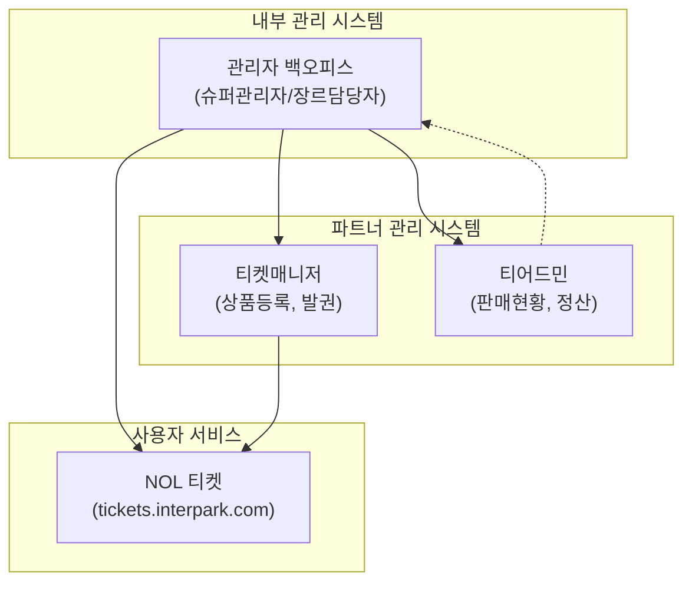

# 관리자 페이지 구조 예측

> 이 문서는 NOL 티켓(인터파크) 프론트엔드 분석을 통해 역추론한 관리자 기능입니다.
> 분석 일시: 2026-03-25

## 예측 방법론

**"사용자에게 보이는 데이터/기능이 있다면, 이를 관리하는 백오피스 기능이 반드시 존재한다"**는 원칙으로 역추론합니다.

프론트엔드에서 확인된 요소 → 이를 생성/수정/삭제하기 위한 관리 기능 역추론의 흐름을 따릅니다.

### MVP 우선순위 분류

> 아래 역추론된 관리 기능은 전체 목표 상태를 서술합니다. MVP에서 필요한 기능과 장기적으로 필요한 기능을 구분합니다:
>
> | 우선순위 | 관리 기능 | Phase |
> |---------|-----------|-------|
> | **필수** | 공연 CRUD, 회차 관리, 예매 조회/취소/환불, 기본 사용자 조회 | Phase 1 (MVP) |
> | **중요** | 대시보드, 프로모션/쿠폰 관리, 배너 관리, 정산 기본 | Phase 2 |
> | **확장** | 좌석 배치도 에디터, 블랙리스트, A/B 테스트 배너, 고급 통계, RBAC 세분화 | Phase 3+ |
>
> 이 문서의 모든 기능을 한 번에 구현하지 않습니다. MVP에서는 "필수" 항목만 구현하고, 나머지는 단계적으로 확장합니다.

---

## 1. 대시보드

### 예측 근거
- 홈페이지에 실시간 타임딜 카운트다운, 랭킹 예매율(%), 순위 변동이 표시됨
- 판매 안내 페이지에서 정산 프로세스, 판매현황 확인 언급 ("티어드민을 통해 판매현황 및 예매자 명단을 확인할 수 있습니다")
- 대기열 시스템이 존재하므로 실시간 모니터링 필요

### 예상 화면 구성

**실시간 모니터링 대시보드:**
- 오늘의 예매 건수 / 매출액 (실시간 업데이트)
- 현재 동시접속자 수
- 대기열 활성 공연 및 대기 인원
- 장르별 예매 비율 파이차트
- 시간대별 예매 트렌드 라인차트
- 인기 공연 TOP 10 (예매율 기반)
- 오픈 예정 공연 일정 (D-day 표시)
- 시스템 상태 (서버, DB, Redis, PG사 연동)

### 필요 API 엔드포인트

| Method | Endpoint | 설명 |
|--------|----------|------|
| GET | `/admin/api/v1/dashboard/summary` | 오늘 요약 (매출, 예매, 취소) |
| GET | `/admin/api/v1/dashboard/realtime` | 실시간 지표 (SSE/WebSocket) |
| GET | `/admin/api/v1/dashboard/traffic` | 트래픽 현황 |
| GET | `/admin/api/v1/dashboard/queue-status` | 대기열 현황 |

---

## 2. 공연/이벤트 관리

### 예측 근거
- 상품 상세 페이지에 장소, 공연기간, 공연시간, 관람연령, 가격(등급별), 혜택, 프로모션, 관련공연 등 다양한 메타데이터 존재
- 배지 시스템: 단독판매, 좌석우위, 예매대기, 로터리 등 다양한 판매 유형
- 캐스팅 정보, 캐스팅 일정 조회 기능 존재
- 카테고리 서브필터(요즘 HOT, 오리지널/내한 등)는 관리자가 태깅
- 판매 안내에서 "티켓매니저에서 신규 상품등록의뢰서 작성" 언급

### 예상 화면 구성

**공연 목록:**
- 전체 공연 테이블 (검색, 필터, 정렬)
- 상태 필터: 판매중, 판매예정, 판매종료, 임시저장
- 빠른 필터: 장르별, 공연장별, 기간별
- 일괄 작업: 상태 변경, 배지 부여

**공연 등록/수정 (CRUD):**
- 기본 정보: 공연명, 장르, 서브장르, 관람연령, 공연시간, 설명
- 미디어: 포스터 이미지 업로드, 상세 정보 이미지(HTML 에디터)
- 공연장: 공연장 선택 → 좌석 배치도 자동 연결
- 가격: 등급별 가격 설정 (VIP/R/S/A 등), 할인 가격
- 판매 설정: 판매 유형(일반/로터리/예매대기), 배지, 1인 최대 매수
- 태그: 서브카테고리 태깅(요즘 HOT, 오리지널 등)
- 관련 공연 연결

**회차 관리:**
- 날짜별 회차 목록 (캘린더 뷰 / 리스트 뷰)
- 회차 등록: 날짜, 시간, 세션 번호
- 회차 상태: 판매중, 매진, 취소
- 예매 가능 시간 설정 (전일 17시까지 등)
- 일괄 등록 (패턴 기반: "매주 화-토 19:30, 주말 14:00/18:00")

**캐스팅 관리:**
- 배우 등록 (이름, 프로필 이미지, 역할)
- 회차별 캐스팅 배정 (캘린더 드래그&드롭)
- 캐스팅 일정표 발행

**좌석 배치도 에디터:**
- SVG 기반 좌석맵 편집기
- 등급 영역 설정 (드래그로 영역 지정)
- 좌석별 속성 설정 (행, 번호, 등급, 가격)
- 장애인석, 휠체어석 등 특수 좌석 지정
- 시야 제한석 표시

### 필요 API 엔드포인트

| Method | Endpoint | 설명 |
|--------|----------|------|
| GET | `/admin/api/v1/performances` | 공연 목록 |
| POST | `/admin/api/v1/performances` | 공연 등록 |
| PUT | `/admin/api/v1/performances/:id` | 공연 수정 |
| DELETE | `/admin/api/v1/performances/:id` | 공연 삭제 |
| PUT | `/admin/api/v1/performances/:id/status` | 상태 변경 |
| GET | `/admin/api/v1/performances/:id/schedules` | 회차 목록 |
| POST | `/admin/api/v1/performances/:id/schedules/bulk` | 회차 일괄 등록 |
| PUT | `/admin/api/v1/schedules/:id` | 회차 수정 |
| GET | `/admin/api/v1/performances/:id/castings` | 캐스팅 관리 |
| POST | `/admin/api/v1/castings` | 캐스팅 등록 |
| GET | `/admin/api/v1/seat-maps` | 좌석 배치도 목록 |
| POST | `/admin/api/v1/seat-maps` | 좌석 배치도 등록 |
| PUT | `/admin/api/v1/seat-maps/:id` | 좌석 배치도 수정 |

---

## 3. 예매/주문 관리

### 예측 근거
- 마이페이지에 예매확인/취소 기능 존재
- 예매번호가 발급됨 (reservation_number)
- 좌석 선택 페이지에서 취소/환불 안내 팝업에 취소마감시간 표시
- 판매 안내에서 "티어드민을 통해 예매자 명단을 확인할 수 있습니다" 언급
- 다양한 결제 수단 (카드, 간편결제, 계좌이체)

### 예상 화면 구성

**예매 조회:**
- 검색: 예매번호, 사용자명, 연락처, 공연명
- 필터: 상태(예매완료/취소/환불대기), 기간, 결제수단
- 테이블: 예매번호, 사용자, 공연명, 일시, 좌석, 금액, 상태, 결제일시
- 엑셀 다운로드 (예매자 명단)

**예매 상세:**
- 예매 정보: 번호, 상태, 일시
- 사용자 정보: 이름, 연락처, 이메일
- 공연/좌석 정보: 공연명, 날짜, 회차, 좌석(등급/행/번호)
- 결제 정보: 결제수단, 금액, PG 트랜잭션 ID
- 할인/쿠폰 적용 내역
- 이력 로그 (상태 변경 타임라인)

**상태 변경:**
- 예매 확정 / 취소 / 환불 처리
- 부분 취소 (다수 좌석 중 일부)
- 관리자 메모 입력

**환불 처리:**
- 환불 사유 선택/입력
- 환불 금액 계산 (수수료 적용)
- PG사 환불 요청 연동
- 환불 상태 추적

**예매 통계:**
- 공연별 예매 현황 (좌석 점유율)
- 시간대별 예매 추이
- 취소율 통계
- 결제수단별 통계

### 필요 API 엔드포인트

| Method | Endpoint | 설명 |
|--------|----------|------|
| GET | `/admin/api/v1/reservations` | 예매 목록 |
| GET | `/admin/api/v1/reservations/:id` | 예매 상세 |
| PUT | `/admin/api/v1/reservations/:id/status` | 상태 변경 |
| POST | `/admin/api/v1/reservations/:id/refund` | 환불 처리 |
| GET | `/admin/api/v1/reservations/export` | 엑셀 다운로드 |
| GET | `/admin/api/v1/reservations/statistics` | 예매 통계 |

---

## 4. 사용자 관리

### 예측 근거
- 로그인 상태에서 닉네임(박상우님) 표시
- "내 예약" 메뉴 존재
- 티켓캐스트(알림) 등록/취소 기능
- 멤버십 등급 시스템 추정 (NOL 카드, 적립 프로모션)
- 관람후기/기대평 작성 기능

### 예상 화면 구성

**회원 조회:**
- 검색: 이름, 이메일, 연락처, 회원번호
- 필터: 등급, 가입일, 마지막 로그인
- 회원 상세: 기본 정보, 예매 이력, 포인트/쿠폰, 활동 로그

**등급 관리:**
- 멤버십 등급 정의 (일반, 실버, 골드, VIP 등)
- 등급 산정 기준 설정 (예매 횟수, 결제 금액)
- 등급별 혜택 설정

**블랙리스트:**
- 매크로/봇 사용 의심 사용자
- 다중 계정 사용자
- 악성 취소 반복 사용자
- 차단 사유 입력 및 해제 관리

### 필요 API 엔드포인트

| Method | Endpoint | 설명 |
|--------|----------|------|
| GET | `/admin/api/v1/users` | 회원 목록 |
| GET | `/admin/api/v1/users/:id` | 회원 상세 |
| PUT | `/admin/api/v1/users/:id/grade` | 등급 변경 |
| POST | `/admin/api/v1/users/:id/blacklist` | 블랙리스트 등록 |
| DELETE | `/admin/api/v1/users/:id/blacklist` | 블랙리스트 해제 |

---

## 5. 프로모션 관리

### 예측 근거
- 홈페이지에 타임딜(카운트다운), 파이널콜(임박공연 특가), 얼리버드, 프리뷰, 마티네, 재관람 등 다양한 할인 유형
- 각 할인에 할인율(40%, 30% 등)과 D-day 표시
- "카카오머니 결제 시 4천원 즉시할인(일 선착순)" 프로모션
- 기획전 페이지 (events.interpark.com)
- 무이자할부 카드사별 안내
- 상세 페이지에 프로모션 배너 (NOL 카드 적립, 토핑 등)

### 예상 화면 구성

**쿠폰 관리:**
- 쿠폰 생성: 코드, 할인 유형(정율/정액), 할인 값, 유효 기간, 사용 조건
- 쿠폰 발급: 대상 선택(전체/등급별/개별), 발급 방법(자동/수동)
- 쿠폰 사용 현황 통계

**할인 정책:**
- 타임딜 설정: 대상 공연, 할인율, 시작/종료 시간
- 파이널콜 자동화: 임박 공연 자동 할인 규칙
- 얼리버드: 기간, 대상, 할인율
- 재관람 할인: 인증 방식, 할인율
- 카드사 즉시할인: 카드사, 할인 금액, 일별 한도

**기획전/배너 관리:**
- 기획전 페이지 생성 (events.interpark.com)
- 홈페이지 배너 등록: 이미지, 링크, 노출 기간, 위치
- 배너 정렬 순서 관리 (드래그&드롭)
- A/B 테스트 설정

### 필요 API 엔드포인트

| Method | Endpoint | 설명 |
|--------|----------|------|
| GET | `/admin/api/v1/promotions` | 프로모션 목록 |
| POST | `/admin/api/v1/promotions` | 프로모션 생성 |
| PUT | `/admin/api/v1/promotions/:id` | 프로모션 수정 |
| GET | `/admin/api/v1/coupons` | 쿠폰 목록 |
| POST | `/admin/api/v1/coupons` | 쿠폰 생성 |
| POST | `/admin/api/v1/coupons/:id/issue` | 쿠폰 발급 |
| GET | `/admin/api/v1/banners` | 배너 목록 |
| POST | `/admin/api/v1/banners` | 배너 등록 |
| PUT | `/admin/api/v1/banners/order` | 배너 정렬 |

---

## 6. 정산 관리

### 예측 근거
- 판매 안내 페이지에서 정산 프로세스가 명시적으로 설명됨:
  - "마지막 공연 종료 후 영업일 3-4일 이내 정산서 발행"
  - "티어드민에서 정산서 확인/승인"
  - "정산서 승인 후 영업일 3-4일 이내 입금"
- 다양한 장르별 담당자/연락처가 존재 (각 장르별 수수료율이 다를 수 있음)

### 예상 화면 구성

**정산 대시보드:**
- 월별 정산 총액 / 건수
- 정산 상태별 건수 (대기/발행/승인/입금완료)
- 정산 일정 캘린더

**판매자/기획사 정산:**
- 정산 대상 목록 (기획사/공연장별)
- 정산서 자동 생성 (공연 종료 후 영업일 3-4일)
- 정산서 내역: 총 예매 건수, 총 매출, 수수료, 환불 차감, 최종 정산금
- 정산서 승인/반려 워크플로우
- 입금 처리 및 확인

**수수료 관리:**
- 장르별 기본 수수료율 설정
- 기획사별 개별 수수료율 설정
- 수수료 계산 규칙 (매출 기준, 건당 등)

### 필요 API 엔드포인트

| Method | Endpoint | 설명 |
|--------|----------|------|
| GET | `/admin/api/v1/settlements` | 정산 목록 |
| GET | `/admin/api/v1/settlements/:id` | 정산 상세 |
| POST | `/admin/api/v1/settlements/:id/approve` | 정산 승인 |
| POST | `/admin/api/v1/settlements/:id/reject` | 정산 반려 |
| POST | `/admin/api/v1/settlements/:id/payment` | 입금 처리 |
| GET | `/admin/api/v1/commission-rates` | 수수료율 관리 |
| PUT | `/admin/api/v1/commission-rates/:id` | 수수료율 수정 |

---

## 7. 콘텐츠 관리

### 예측 근거
- Footer에 "공지사항" 링크 존재
- 상세 페이지에 "판매정보" 탭 (취소/환불 규정, 배송 안내 등)
- 이용약관, 개인정보처리방침 링크
- 홈페이지 배너 슬라이더 (기획전, 프로모션 배너)
- 기대평/관람후기 시스템
- 티켓판매안내 페이지 (정적 콘텐츠)
- "이 공연이 더 궁금하다면" → play/performance 페이지 (공연 상세 콘텐츠)

### 예상 화면 구성

**공지사항 관리:**
- 공지사항 CRUD
- 카테고리 분류 (일반, 시스템, 이벤트)
- 상단 고정 설정
- 발행 예약

**FAQ 관리:**
- 카테고리별 FAQ CRUD
- 정렬 순서 관리

**약관 관리:**
- 이용약관, 개인정보처리방침, 위치기반서비스 약관
- 버전 관리 및 이력

**메인 페이지 관리:**
- 배너 관리 (이미지, 링크, 노출 기간)
- 추천 공연 설정 (장르별 추천 리스트)
- 타임딜/파이널콜 노출 공연 선택
- 섹션 노출 순서 관리

**리뷰 관리:**
- 관람후기/기대평 목록
- 신고된 리뷰 관리
- 리뷰 삭제/숨기기
- 베스트 리뷰 선정

### 필요 API 엔드포인트

| Method | Endpoint | 설명 |
|--------|----------|------|
| GET | `/admin/api/v1/notices` | 공지사항 목록 |
| POST | `/admin/api/v1/notices` | 공지사항 등록 |
| PUT | `/admin/api/v1/notices/:id` | 공지사항 수정 |
| GET | `/admin/api/v1/faqs` | FAQ 목록 |
| POST | `/admin/api/v1/faqs` | FAQ 등록 |
| GET | `/admin/api/v1/reviews` | 리뷰 관리 목록 |
| PUT | `/admin/api/v1/reviews/:id/status` | 리뷰 상태 변경 |
| GET | `/admin/api/v1/home-config` | 메인 페이지 설정 |
| PUT | `/admin/api/v1/home-config` | 메인 페이지 설정 변경 |

---

## 8. 시스템 설정

### 예측 근거
- 판매 안내에서 다양한 담당자 역할 분류 (콘서트, 클래식, 뮤지컬, 연극, 전시, 스포츠, 현장운영 등)
- 각 담당자별 전용 이메일 주소 존재 → 역할 기반 접근 제어(RBAC) 추정
- 대기열 시스템 → 트래픽 임계값 설정 필요
- 다국어 지원 (Language 버튼) → 다국어 콘텐츠 관리

### 예상 화면 구성

**권한 관리 (RBAC):**

| 역할 | 권한 범위 |
|------|-----------|
| 슈퍼 관리자 | 전체 시스템 관리 |
| 장르 담당자 | 해당 장르 공연 관리, 예매 조회 |
| 기획사 파트너 | 본인 공연만 조회/관리 (티켓매니저/티어드민) |
| 정산 담당자 | 정산 관리 |
| CS 담당자 | 예매 조회, 환불 처리, 고객 문의 |
| 콘텐츠 담당자 | 공지, FAQ, 배너, 기획전 |
| 현장 운영자 | 현장 발권, 입장 확인 |

**알림 설정:**
- 이메일/SMS/알림톡 템플릿 관리
- 발송 조건 설정 (예매 완료, 취소, D-day 알림, 티켓캐스트)
- 발송 이력 조회

**대기열 설정:**
- 공연별 대기열 활성화 임계값
- 초당 입장 인원 제한
- 대기열 페이지 커스터마이징 (안내 메시지)

**로그 조회:**
- 관리자 활동 로그 (누가, 언제, 무엇을)
- 시스템 로그 (에러, 경고)
- 결제 로그 (PG 트랜잭션)
- 접근 로그 (IP, 디바이스)

### 필요 API 엔드포인트

| Method | Endpoint | 설명 |
|--------|----------|------|
| GET | `/admin/api/v1/roles` | 역할 목록 |
| POST | `/admin/api/v1/roles` | 역할 생성 |
| PUT | `/admin/api/v1/roles/:id/permissions` | 권한 설정 |
| GET | `/admin/api/v1/admin-users` | 관리자 계정 목록 |
| POST | `/admin/api/v1/admin-users` | 관리자 계정 생성 |
| GET | `/admin/api/v1/notification-templates` | 알림 템플릿 |
| PUT | `/admin/api/v1/notification-templates/:id` | 템플릿 수정 |
| GET | `/admin/api/v1/queue-settings` | 대기열 설정 |
| PUT | `/admin/api/v1/queue-settings/:performanceId` | 대기열 설정 변경 |
| GET | `/admin/api/v1/logs` | 로그 조회 |

---

## 부록: 관리 도구 체계 (판매 안내에서 확인)

참조 사이트의 판매 안내 페이지에서 두 가지 관리 시스템이 명시적으로 언급되었습니다:

### 티켓매니저 (Ticket Manager) — 파트너(판매자) 용
- 파트너 신청
- 신규 상품등록의뢰서 작성/접수
- 티켓 발권 신청

### 티어드민 (TierAdmin) — 파트너(판매자) 용
- 판매현황 조회
- 예매자 명단 확인
- 정산서 확인 및 승인

이 두 시스템은 외부 파트너(기획사, 공연장)를 위한 관리 도구이며, 내부 관리자용 백오피스는 별도로 존재할 것으로 추정됩니다. 내부 백오피스는 위에서 역추론한 전체 관리 기능을 포함하며, 티켓매니저/티어드민의 기능을 상위 레벨에서 관리하는 구조일 것입니다.

---

## 아키텍처 통합 가이드

> 이 문서의 관리자 기능은 `03-ARCHITECTURE.md`의 NestJS 모듈러 모놀리스에 통합되어야 합니다.

### 관리자 API 통합 전략

**라우팅 분리:**
- 사용자 API: `/api/v1/...` (기존 03-ARCHITECTURE 정의)
- 관리자 API: `/api/v1/admin/...` (같은 NestJS 인스턴스, prefix로 분리)
- 별도 도메인/서비스 분리는 불필요 (모듈러 모놀리스 원칙 유지)

**인증/인가:**
- 관리자도 동일한 JWT 인증 체계 사용 (03-ARCHITECTURE의 AuthModule)
- 추가 Guard: `@Roles('ADMIN', 'GENRE_MANAGER', 'CS_AGENT')` 데코레이터 + `RolesGuard`
- 관리자 전용 미들웨어: IP 화이트리스트 (선택적), 2FA (Phase 2+)

**관리자 프론트엔드 기술 스택 (권장):**
- **MVP:** Next.js 16 내부에 `/admin` 라우트 그룹으로 포함 (별도 빌드 불필요)
- **성장기:** 별도 Next.js 앱 (`apps/admin`)으로 분리하여 독립 배포
- **대안:** Retool/AdminJS 같은 로우코드 도구 (빠른 프로토타이핑용)
